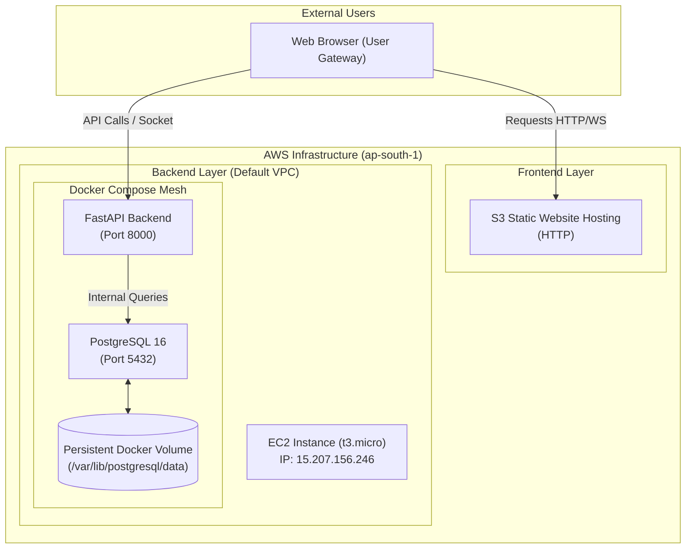

# Trade Spark: Architecture Overview (Cost-Optimized)

This document provides a technical and financial breakdown of the **Trade Spark** infrastructure. The current design is optimized for low operating costs (~$10-15/month) while maintaining a robust CI/CD pipeline and automated deployments.

---

## 1. System Architecture

We utilize a **Monolithic Single-Server** model. All core logic and data storage reside on a single EC2 instance to eliminate the overhead of managed AWS services.



---

## 2. Technology Stack

| Layer | Technology | Role |
| :--- | :--- | :--- |
| **Frontend** | React / Vite | User Interface |
| **Backend** | FastAPI (Python) | API Logic & Market Data Streaming |
| **Database** | PostgreSQL | Transaction & Portfolio Storage |
| **Containerization** | Docker & Docker Compose | Unified service management |
| **Infrastructure** | Terraform | Infrastructure as Code (IaC) |
| **CI/CD** | GitHub Actions | Automated build and deploy |

---

## 3. Financial Breakdown (Estimation)

By moving away from managed services (ALB, RDS, NAT Gateway), we have reduced the monthly burn by **~85%**.

| Resource | Unit Cost | Monthly Estimate | Notes |
| :--- | :--- | :--- | :--- |
| **EC2 (t3.micro)** | $0.0104/hr | ~$7.50 | $0.00 if inside Free Tier (12 months) |
| **S3 Hosting** | $0.023/GB | ~$0.10 | Negligible for static assets |
| **IPv4 Address** | $0.005/hr | ~$3.60 | Standard AWS fee for all public IPs |
| **Data Transfer** | Variable | ~$1.00 | Free up to 100GB/month |
| **Total** | | **~$12.20** | **Total Savings: ~$78.00/mo** |

---

## 4. Maintenance & Operations

### **How to Deploy Updates**
1. **Source Code:** Simply `git push` to the `main` branch. GitHub Actions will handle the rest.
2. **Infrastructure:** Navigate to the `terraform` folder and run `terraform apply`.

### **Monitoring the App**
To view logs or check the health of the backend, SSH into the server and run:
```bash
cd /home/ec2-user/app
docker compose logs -f
```

### **Manual Backup**
The database data is stored in a Docker Volume. To create a manual backup:
```bash
docker exec -t trade-spark-db pg_dumpall -c -U postgres > backup.sql
```

---

> [!TIP]
> **Scaling Future:** If your user base grows beyond 1,000 active users, you can "vertically scale" by simply changing the EC2 instance type from `t3.micro` to `t3.medium` in your Terraform code. No complex architecture changes required!
